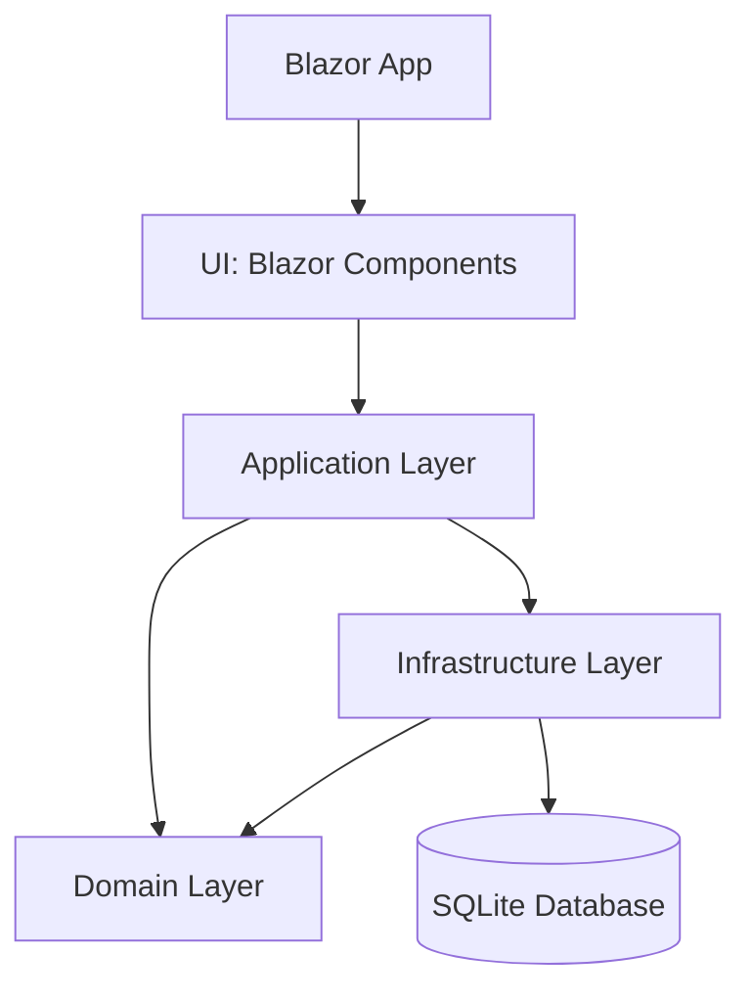

# SimpleBookCatalog

A modern Blazor Web Application for managing a book catalog, built with .NET 8 and Entity Framework Core.
---

## Features
- Add, edit, delete, and list books
- Modern, responsive UI with macOS-inspired design
- Entity Framework Core with SQLite and sample seed data
- Clean architecture: Domain, Application, Infrastructure, and UI layers
- Blazor Server (interactive components)

---

## Project Structure



- **UI (Blazor Components):** Razor components for pages, forms, dialogs, and cards.
- **Application Layer:** Interfaces and business logic (e.g., `IBookRepository`).
- **Domain Layer:** Core entities and enums (e.g., `Book`, `Catagory`).
- **Infrastructure Layer:** Data access (EF Core DbContext, repository implementations, migrations).
- **Database:** SQLite, seeded with sample data.

---

## Key Concepts

### 1. Blazor Components
- `.razor` files for UI (e.g., `BookForm.razor`, `BookCard.razor`, `List.razor`)
- Uses data binding, event callbacks, and dependency injection

### 2. Clean Architecture
- **Domain:** Business entities and enums
- **Application:** Interfaces and contracts
- **Infrastructure:** Data access, migrations, repository implementations
- **UI:** Blazor components and pages

### 3. Entity Framework Core
- `SimpleBookCatalogDbContext` manages the `Books` table
- Migrations for schema and seed data
- Repository pattern for data access

### 4. Dependency Injection
- Services (like `IBookRepository`) are injected into components and other services

### 5. Modern UI/UX
- macOS-inspired design with frosted glass, rounded corners, and system colors
- Responsive and dark mode support

---

## Getting Started

1. **Restore NuGet packages:**
   ```sh
   dotnet restore
   ```
2. **Apply migrations and seed data:**
   ```sh
   dotnet ef database update --project SimpleBookCatalog.Infrastructure
   ```
3. **Run the app:**
   ```sh
   dotnet run --project SimpleBookCatalog
   ```
4. **Browse to:** `https://localhost:5001` (or the port shown in your terminal)

---

## Sample Data
The app comes with sample books for Science, Fitness, Technology, and Travel categories.

---

## Customization
- Update styles in `wwwroot/app.css` and component-specific `.razor.css` files
- Add new features by creating new Razor components and updating the repository

